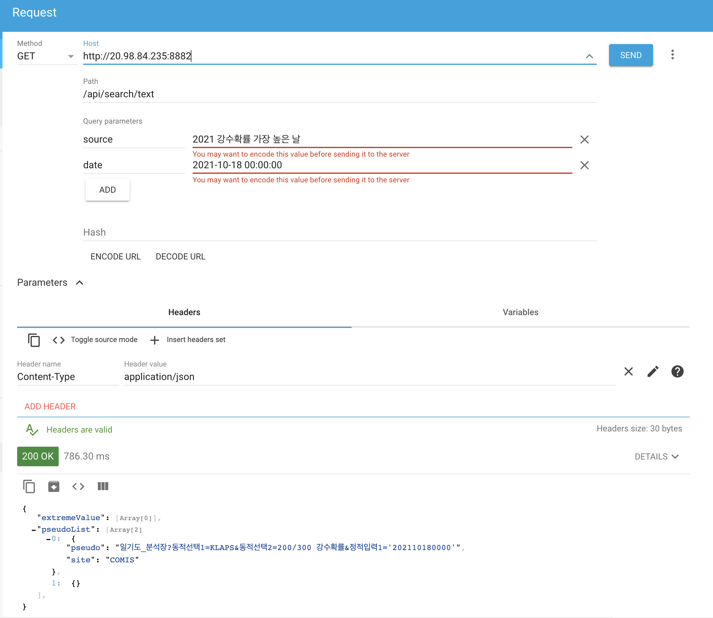

# 기상과학원 검색기 docker file


## Docker image 내려받기
먼저 사용되는 코드와 모델이 들어있는 docker image를 docker hub에서 내려받습니다.
```
sudo docker pull msyoon8/weather:latest
```
## Docker image 실행하기

```
sudo docker run -d -p 8887:8887 --gpus all msyoon8/weather:latest python3 home/KoBART-summarization/run_api.py 8887 cpu
```
- 적어줘야 하는 인자는 총 두 개 (port number, cpu/gpu 여부) 입니다.
- Port number는 원하시는 port로 지정하실 수 있습니다. (위의 예시에서 port number는 8887)
- 마지막 인자로는 해당 device가 gpu가 있으면 gpu, cpu로 돌리고 싶다면 cpu를 적어줍니다. (다른 것을 적으면 에러 발생)
- 단, cpu로 돌릴 시 모델의 실행 속도는 현저히 낮아집니다 (한 쿼리당 약 10초정도). 제 local computer에서 cpu와 gpu 모두 정상작동하는것을 확인하였습니다.
- GET 형태의 형식에 맞는 요청을 보내면, 아래 예시와 같은 pseudo url을 output합니다.
- GET 형태 url 예시: `http://20.98.84.235:8882/api/search/text?source=2021 강수확률 가장 높은 날&date=2021-10-18 00:00:00`
## Example



- [advanced rest client](https://chrome.google.com/webstore/detail/advanced-rest-client/hgmloofddffdnphfgcellkdfbfbjeloo/related) 를 이용해 정상 동작 여부를 확인하였습니다.
